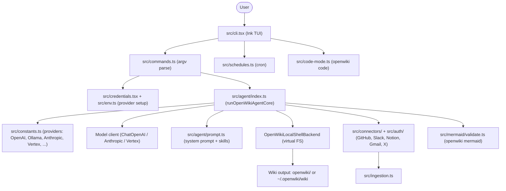

# OpenWiki architecture map

This page is the visual entry point for the OpenWiki codebase. For the prose
walkthrough of each module, see [Architecture overview](architecture/overview.md)
and the [Quickstart](quickstart.md).

## How the pieces fit

- **Entry and control flow**: `src/cli.tsx` is the interactive Ink terminal app. It
  parses arguments via `src/commands.ts` and routes to the agent run, the
  credential/onboarding flow, scheduled runs (`src/schedules.ts`), or code-mode
  setup (`src/code-mode.ts`).
- **Agent core**: `src/agent/index.ts` resolves the provider, builds the model
  client, loads the system prompt and skills (`src/agent/prompt.ts`), and runs the
  DeepAgents documentation agent through the `OpenWikiLocalShellBackend`, which
  writes into a virtual filesystem rooted at the repository.
- **Providers**: `src/constants.ts` centralizes every provider's API key, base URL,
  model list, and validation — including Ollama Cloud and the OpenAI-compatible path.
- **Connectors and ingestion**: `src/connectors/` and `src/auth/` supply external
  sources (GitHub, Slack, Notion, Gmail, X) consumed by `src/ingestion.ts`.
- **Diagrams**: generated Mermaid blocks are validated by `src/mermaid/validate.ts`
  via the `openwiki mermaid` command, so broken diagrams are caught before a run
  finishes.
- **Output**: the agent writes OKF-formatted Markdown pages into `openwiki/` (code
  mode) or `~/.openwiki/wiki` (personal mode), with `map.md` as the visual overview.
